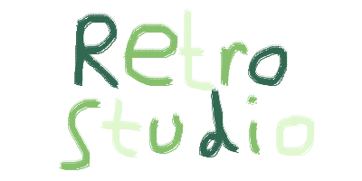

  
## What is RetroStudio?
RetroStudio is a SDK for making retro styled games that can be played on modern hardware. Basically, it's Unity but it makes games that are in .exe and .app formats but look like they are being played on a GameBoy emulator even though they are modern and are built for computers.
